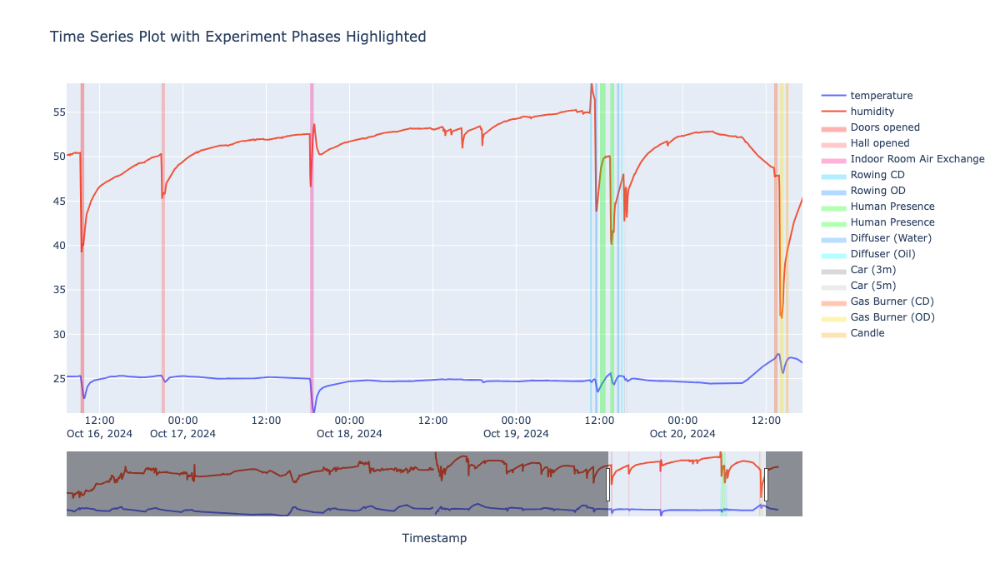
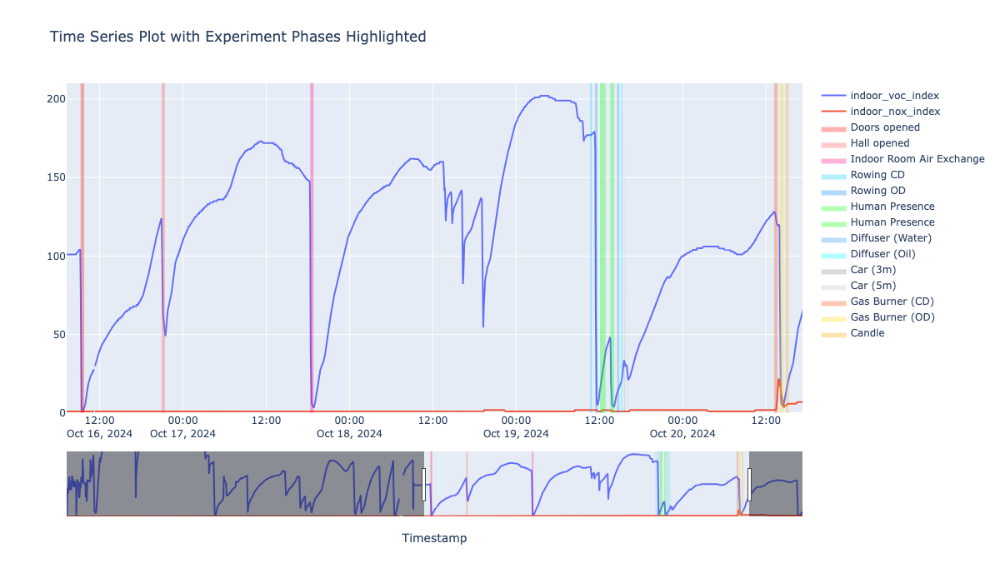

# Data Analysis

run read_data.ipynb and air_wings.ipynb to download and preprocess the data.
all analysis are in the notebooks folder.

## Notebooks

Each location was first analyzed individually. A correlation matrix was created at each site to check for potential correlations between pollutant levels and weather data as observed across various sensor readings. Events monitored included: **Doors Opened**, **Hall Opened**, **Indoor Room Air Exchange**, **Rowing (CD)**, **Rowing (OD)**, **Human Presence**, **Diffuser (Water)**, **Diffuser (Oil)**, **Car (3m)**, **Car (5m)**, **Gas Burner (CD)**, **Gas Burner (OD)**, and **Candle**.

For a detailed event analysis, the mean difference percentage was calculated for each event. This metric simulates the change in the target variable due to specific events. Additionally, a correlation matrix for these difference percentages was generated to examine potential correlations between changes induced by different events. If you are intrested in any in depth timeseries plot you can run notebooks and check them out

## airwings

### indoors

#### PM particles

**Correlation matrix**

All PM sensors show a high correlation with the reference Airwings sensor, except for sensors with IDs 2.0 and 3.0, which display inaccurate measurements when compared to the reference sensor.

    
    
    

 

**Timeseries**

Here, we observe that sensors with IDs 2.0 and 3.0 do not align with the measurements from the reference Airwings sensors and fail to register events in the same way the reference sensor does.

#### Temperature and Humidity

For temperature and humidity readings, we observe lower oscillations in correlation within the Airwings sensor (ID 5) and higher oscillations within sensor 2. These oscillations are also evident in the time series plots, where the sensor with ID 2 shows a pattern that deviates significantly from the reference sensor.

**Correlation Temperature**

**Timeseries Temperature**  

**Correlation Humidity**

**Timeseries Humidity**

#### co2 

The sensors do not correlate with the reference sensor, but they do show correlations with one another for IDs ranging from 3 to 15. The sensor with ID 2, however, does not correlate with any sensor readings. For **further analysis, it would be useful to compare readings from additional reference sensors to assess the validity of the current reference Airwings sensor. ADD MORE** 

**Correlation**

**Timeseries**

#### pressure 

Pressure readings show correlation across all sensors. For further refinement, calibration against the reference sensor could be added.

**Correlation**

**Timeseries**

#### tvoc

TVOC readings are inconsistent across the entire range. A few sensors show correlations with a coefficient above 0.5; however, none of the sensors correlate with the reference sensor.

**Correlation**

**Timeseries**

### inbiot

All PM sensors correlate with each other, and other pollutants such as CO₂, formaldehyde, and TVOC also show correlations with PM sensors, with a coefficient above 0.5.

#### pm 

#### tvoc and weather

#### co2

#### formaldehyde

### kaiterra

PM sensors perfectly correlate with each other, and other pollutants such as CO₂, formaldehyde, and TVOC also show correlations with PM sensors, with a coefficient above 0.8.

#### pm 

#### tvoc

#### co2

### ls_168

PM sensors perfectly correlate with each other, and other pollutants such co (0.63-0.64) and co2 (0.47)

#### pm 

#### O3 and NO2

#### CO2 and CO

#### temperature and humidity

### ls_169

PM sensors perfectly correlate with each other, and other pollutants correlate highly such co2 (0.82) and co (0.87). 

#### pm 

#### O3 and NO2

#### CO2 and CO

#### temperature and humidity

### smart sense

PM sensors perfectly correlate with each other, and other pollutants correlate highly such co2 (0.83). 

#### pm

#### co2

#### temperature

#### voc_nox_index

### Palas referent sensor

PM sensors perfectly correlate with each other, and other pollutants correlate highly such co2 (0.72) and voc (0.68-0.69). 

#### pm

#### co2

#### temperature, humidity AQI and Infection risk

#### voc

## All sensors

### PM10

All PM₁₀ sensors show a high correlation with each other (0.99–1.00), except for Airwings sensors 2 and 3, which do not correlate with any other sensors. When we analyze events, most events follow same changes in for every sensor besides air wings sensors 1 and 2 which don't capture any events.   

#### PM10 offset

Although events are captured across most sensors, further analysis using boxplots and time series plots reveals offsets between all sensors and the reference sensor. This suggests that calibration against the reference sensor would be beneficial.

### co2

In our sensor analysis, we observe that Airwings sensors correlate with each other but do not correlate with either the Airwings reference sensor (ID 316.0) or the Palas sensor. Other sensors, such as Inbiot, Kaiterra, LS, and Smart Sense, show strong correlations with the reference sensors. From this analysis, we can conclude that the Airwings reference sensor (AWI 316.0) follows measurements from the reference Palas sensor with a correlation coefficient of 0.8.

However, when examining differences specifically during events, the AWI 316.0 sensor does not capture these changes as effectively, as indicated by the percentage difference average plot and difference correlation matrix. Sensors like Kaiterra, LS, and Smart Sense provide measurements that align well with the reference Palas sensor when event data is analyzed independently.

#### co2 offset

Similar to the PM₁₀ sensor readings, there is an offset between sensor readings despite high correlation and successful event capture. This suggests that calibration against the reference sensor would be beneficial. 

### Humidity

There is strong correlation between on all senors humidity readings besides on air wings senors 2 and 5 which show higher oscilations in correlation coeff. We see that events are reflect on both airwings senosors (besides sensor 2), Inbiot, kaiterra, referent, LS_169 and LS_168. Also, airwings sensor correlate more within each other than with other sensors

#### humidity offset

There is an offset in measurements for each sensor when compared to the reference sensor, indicating the need for calibration. This offset is evident in both boxplot and time series data.

### Temperature

There is strong correlation between on all senors humidity readings besides on air wings senors 2 (0.52-0.60). We see that events are reflect on both airwings senosors (besides sensor 2), Inbiot, kaiterra, referent, LS_169 and LS_168.

#### Temperature offset

There is an offset in measurements for each sensor when compared to the reference sensor, indicating the need for calibration. This offset is evident in both boxplot and time series data.

### Pressure

There is perfect correlation between on all senors humidity readings 

